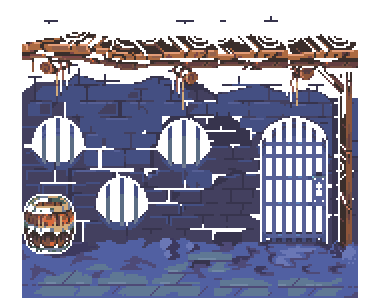

# DungeonMania RPG java Game

This game written in Java is called DungeonMania, implemented using the Spark web framework. It manages user sessions and game-related actions through various API endpoints. The code ensures thread safety for session management, handles exceptions related to invalid actions, and integrates with Scintilla for game loop management. Gson is used for JSON serialization, and the program includes CORS headers for cross-origin support. The init() method sets up routes and initializes dependencies, while the main() method starts the Spark application. Overall, it provides a robust backend for the DungeonMania game with clear organization and functionality.

